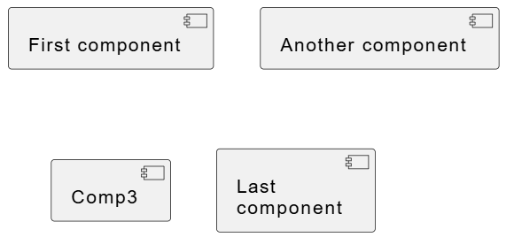

# 2026/04/01

## Todo

- [x] Journal環境整備
  - [x] GuthubにJournal用repositoryを用意
    - ここは今後私的に調査した内容を記録する場所として活用する
  - [x] markdownで図を描きたい
- [ ] POC環境の構成検討

## memo

### markdownで図を描きたい

- VSCodeでmarkdown形式のテキストに作図する場合に便利な選択肢は以下
  - mermaid
    - flow-chartやgit-flow図等割と使いたい作図に対応
    - GitHubでもレンダリング可能
  - PlantUML
    - 構成図を描きたければこちら
    - GitHubではレンダリングできないので画像ファイル化して貼り付ける形になる

#### mermaid

1. VSCodeに以下のextentionをインストール
   - Markdown Preview Mermaid Support
    ```code
    ```mermaid
    ---
    title: Example Git diagram
    ---
    gitGraph
       commit
       commit
       branch develop
       checkout develop
       commit
       commit
       checkout main
       merge develop
       commit
       commit
    ```
    ```mermaid
    ---
    title: Example Git diagram
    ---
    gitGraph
       commit
       commit
       branch develop
       checkout develop
       commit
       commit
       checkout main
       merge develop
       commit
       commit
    ```

#### PlantUml

1. 以下をインストール
   - Java
   - GraphViz
1. 環境変数`GRAPHVIZ_DOT`にGraphVizの`dot.exe`のpathを設定
1. VSCodeに以下のextentionをインストール
   - PlantUML
1. 作図してレンダリング結果を画像ファイルとして保存

   ```code
     ```plantuml
     @startuml

     [First component]
     [Another component] as Comp2
     component Comp3
     component [Last\ncomponent] as Comp4

     @enduml
   ```


1. markdownに差し込む  
  