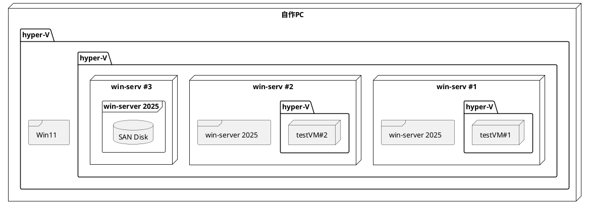

# 2026/04/02

## Todo

- [ ] POC環境の構成検討
  - [x] 実現したい構成について作図
  - [x] 検証クラスタ用にwinの試用ライセンスの有無について確認する
  - [x] hyper-v on hyper-vについて確認

## memo

### 目標の構成



### winの試用ライセンスついて

> Windows Server評価版はインストール後180日、Windows Serverを試用できます（ただし10日以内にMicrosoftによりオンラインで認証される必要があります）。この180日の評価期間が過ぎると、評価版ライセンスは有効期限切れとなり、起動してから1時間後に自動シャットダウンするようになり、事実上、評価できなくなります。

- source: [メモ.　Windows Server 2025評価版の評価期間リセット可能回数は“1回”限りに](https://www.say-tech.co.jp/contents/blog/yamanxworld/2025memo40)
- 10日以内なら認証せずにPOC可能の模様

### hyper-v on hyper-vについて確認

1. VMの設定で以下を有効にする
    - 設定
      - セキュリティ
        - `セキュアブートを有効にする`にチェック
        - `トラステッド プラットフォーム モジュール を有効にする`にチェック
1. 1,2号機にhyper-vをインストールするためHost側で以下を実行する(要管理者)
    1. 仮想化拡張機能を有効化

        ```code
        Set-VMProcessor -VMName "<VMName>" -ExposeVirtualizationExtensions $true
        ```

    1. MACアドレススプーフィングを有効

        ```code
        Set-VMNetworkAdapter -VMName "<VMName>" -MacAddressSpoofing On
        ```

1. OSインストール後にHyper-Vをインストール
    - Hyper-V
      - 移行
        - クラスタ構成にする場合はココでライブマイグレーションを許可しない

### hyper-vクラスタ

1. hyper-vホストにフェールオーバークラスタリング をインストール

   ```code
   Install-WindowsFeature Failover-Clustering -IncludeManagementTools

   ```

1. SAN共有ディスクを用意
   1. 3号機に`iscsiターゲット`をインストール
      - ファイルサービスと記憶領域サービス
        - iscsiターゲットサーバ

### 内部ネットワーク間で通信できない問題

#### 問題

作成したVM間でping疎通を確認しようとすると応答しない

#### 結論

windowsServerではデフォルトでping応答を許可していない

#### 対策

```console
Windows PowerShell
Copyright (C) Microsoft Corporation. All rights reserved.

# ICMPv4 許可
PS C:\Users\Administrator> New-NetFirewallRule `
-Name 'ICMPv4' `
-DisplayName 'ICMPv4' `
-Description 'Allow ICMPv4' `
-Profile Any `
-Direction Inbound `
-Action Allow `
-Protocol ICMPv4 `
-Program Any `
-LocalAddress Any `
-RemoteAddress Any 

# 確認
PS C:\Users\Administrator> Get-NetFirewallRule | Where-Object Name -Like 'ICMPv4' 

Name                          : ICMPv4
DisplayName                   : ICMPv4
Description                   : Allow ICMPv4
DisplayGroup                  :
Group                         :
Enabled                       : True
Profile                       : Any
Platform                      : {}
Direction                     : Inbound
Action                        : Allow
EdgeTraversalPolicy           : Block
LooseSourceMapping            : False
LocalOnlyMapping              : False
Owner                         :
PrimaryStatus                 : OK
Status                        : The rule was parsed successfully from the store. (65536)
EnforcementStatus             : NotApplicable
PolicyStoreSource             : PersistentStore
PolicyStoreSourceType         : Local
RemoteDynamicKeywordAddresses : {}
PolicyAppId                   :
PackageFamilyName             :
```
