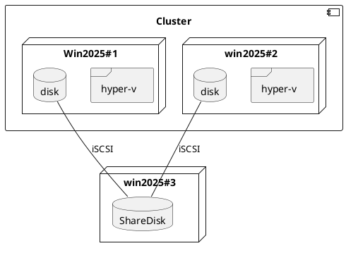

# 2026/04/03

## Todo

- [ ] POC環境の構成検討
  - [ ] hyper-vクラスタについて
    - [ ] 共有ディスク
    - [ ] quorum
    - ~~DNS(ActiveDirectory)~~

## memo

### 今日の構成(目標)




### 3号機の役割

- ~~ActiveDirectory~~
- iscsi-target

### 構築手順

GitHub Copilotです。Active Directoryを使わずにHyper-Vクラスタを作成する手順を、指定の3ノード構成（win2025#1/#2: クラスタノード、win2025#3: iSCSIターゲット）で提示します。ワークグループベースのクラスタは可能ですが、ADの利点（Kerberos認証、GPOなど）がなく、NTLM認証になりセキュリティが低下します。DNSは各ノードのhostsファイルで解決。前提: Windows Server 2025、Hyper-Vホスト上でVM作成済み、ネットワーク設定済み。

#### 0. hyper-vを有効にするために必須の設定(hyper-v hostで実行)

1. 仮想化拡張機能を有効化

    ```code
    Set-VMProcessor -VMName "<VMName>" -ExposeVirtualizationExtensions $true
    ```

1. MACアドレススプーフィングを有効

    ```code
    Set-VMNetworkAdapter -VMName "<VMName>" -MacAddressSpoofing On
    ```

#### 1. 各ノードの基本準備

各ノードで管理者権限PowerShellを実行。

- ホスト名設定:
  - win2025#1: `Rename-Computer -NewName "Win2025-1" -Restart`
  - win2025#2: `Rename-Computer -NewName "Win2025-2" -Restart`
  - win2025#3: `Rename-Computer -NewName "Win2025-3" -Restart`
- IP設定 (固定IP、ゲートウェイ192.168.0.1、DNSなし):
  - win2025#1: `New-NetIPAddress -InterfaceAlias "イーサネット" -IPAddress 192.168.0.11 -PrefixLength 24 -DefaultGateway 192.168.0.1`
  - win2025#2: `New-NetIPAddress -InterfaceAlias "イーサネット" -IPAddress 192.168.0.12 -PrefixLength 24 -DefaultGateway 192.168.0.1`
  - win2025#3: `New-NetIPAddress -InterfaceAlias "イーサネット" -IPAddress 192.168.0.13 -PrefixLength 24 -DefaultGateway 192.168.0.1`
- 時刻同期 (NTPサーバー指定、例: time.windows.com):
  - `w32tm /config /manualpeerlist:"time.windows.com" /syncfromflags:manual /update; w32tm /resync`
- hostsファイル編集 (DNS代替、各ノードで相互名前解決):
  - `Add-Content -Path C:\Windows\System32\drivers\etc\hosts -Value "192.168.0.11 Win2025-1"`
  - `Add-Content -Path C:\Windows\System32\drivers\etc\hosts -Value "192.168.0.12 Win2025-2"`
  - `Add-Content -Path C:\Windows\System32\drivers\etc\hosts -Value "192.168.0.13 Win2025-3"`

#### 2. iSCSIターゲット設定 (win2025#3)

- Hyper-Vインストール:
  - `Install-WindowsFeature Hyper-V -IncludeManagementTools -Restart`
    - 再起動後、確認: `Get-WindowsFeature Hyper-V`
- iSCSIターゲットロールインストール:
  - `Install-WindowsFeature FS-iSCSITarget-Server -IncludeManagementTools`
- 仮想ディスク作成 (例: 60GB):
  - `New-Item -Path "D:\iSCSI" -ItemType Directory`
  - `New-VHD -Path "D:\iSCSI\ClusterDisk.vhdx" -SizeBytes 60GB -Dynamic`
- iSCSIターゲット作成:
  - `New-IscsiServerTarget -TargetName "HVClusterTarget" -InitiatorIds "IPAddress:192.168.0.11","IPAddress:192.168.0.12"`
- 仮想ディスクマッピング:
  - `Add-IscsiVirtualDiskTargetMapping -TargetName "HVClusterTarget" -Path "D:\iSCSI\ClusterDisk.vhdx"`
- ファイアウォール許可:
  - `Enable-NetFirewallRule -DisplayGroup "iSCSI サービス"`

#### 3. Hyper-Vとクラスタリングインストール (win2025#1/#2)

各ノードで実行。

- ロールインストール:
  - `Install-WindowsFeature Hyper-V, Failover-Clustering, RSAT-Clustering-PowerShell -IncludeManagementTools -Restart`
- iSCSIイニシエーター設定:
  - `Set-Service -Name MSiSCSI -StartupType Automatic; Start-Service MSiSCSI`
  - `New-IscsiTargetPortal -TargetPortalAddress 192.168.0.13`  <=== ★今日はここまで
  - `Connect-IscsiTarget -NodeAddress "iqn.1991-05.com.microsoft:win2025-3-hvclustertarget-target" -IsPersistent $true`
- ディスクオンライン化とフォーマット:
  - `Get-Disk | Where-Object { $_.IsOffline -eq $true } | Set-Disk -IsOffline $false`
  - `Initialize-Disk -Number 1 -PartitionStyle GPT`
  - `New-Partition -DiskNumber 1 -UseMaximumSize -AssignDriveLetter`
  - `Format-Volume -DriveLetter D -FileSystem NTFS -NewFileSystemLabel "ClusterDisk"`

#### 4. クラスタ作成 (win2025#1で実行)

- 検証 (ワークグループモード):
  - `Test-Cluster -Node Win2025-1,Win2025-2 -IgnoreStorage`
- 作成 (ワークグループ、静的IP 192.168.0.100):
  - `New-Cluster -Name "HVCluster" -Node Win2025-1,Win2025-2 -StaticAddress 192.168.0.100 -AdministrativeAccessPoint Dns`
- 共有ディスク追加:
  - `Get-ClusterAvailableDisk | Add-ClusterDisk`
- CSV有効化:
  - `Get-ClusterSharedVolume | Add-ClusterSharedVolume`

#### 5. 権限とテスト

- クラスタアクセス (ローカル管理者):
  - `Grant-ClusterAccess -Cluster "HVCluster" -User "Win2025-1\Administrator" -AccessLevel "Full"` (Win2025-2も同様)
- Hyper-V管理者権限:
  - `net localgroup "Hyper-V Administrators" /add "Win2025-1\Administrator"` (各ノード)
- テスト:
  - VM作成: `New-VM -Name "TestVM" -MemoryStartupBytes 1GB -Path "D:\VMs"`
  - フェールオーバー: `Move-ClusterVirtualMachineRole -Name "TestVM" -Node Win2025-2`

#### 注意点

- ADなしなので、ノード間認証はNTLM。パスワード同期必須。
- クォーラム: 共有ディスク使用でNodeAndDiskMajority。
- 制限: GPOなし、Kerberosなし。運用時はAD推奨。
- エラー時は `Get-ClusterLog` でログ確認。

これでワークグループHyper-Vクラスタが作成できます。

<!--
### hyper-vクラスタ作成のためにDNSが必要

#### ActiveDirectory構築手順

以下は、Hyper-Vクラスタ用に必要な AD (Active Directory + DNS) 構築手順の標準的な流れです。  
メモの構成に沿って `Win2025#3` をドメインコントローラー兼 DNS/AD サーバと想定します。

1. サーバー準備
   - OS: Windows Server 2025（最新パッチ適用）
   - ホスト名/固定IP設定
   - ネットワーク: 管理用NICとクラスター用NICを分離（可能なら）
   - 時刻同期: NTP/DCが基準

1. AD DS ロールインストール
   - Server Manager → 役割と機能の追加
   - 「Active Directory ドメインサービス」にチェック
   - 必要機能インストール（DNSサーバーも一緒になる）
   - PowerShell:
     - `Install-WindowsFeature AD-Domain-Services,DNS -IncludeManagementTools`

1. ドメインコントローラー昇格
   - インストール完了後、サーバーマネージャーの通知より「ドメインコントローラーに昇格」
   - 「新しいフォレストを追加」→ ドメイン名例 `cluster.local`
   - ドメインコントローラーオプション: DNS/GC有効、フォレスト機能/ドメイン機能レベル指定
   - DSRMパスワード設定
   - 進めて再起動

1. DNS と IP/名前解決確認
   - DC 上で `ipconfig /all`: IP 固定、DNS に自身の IP
   - DNS 前方/逆引きゾーン自動作成確認
   - `nslookup cluster.local` などチェック
   - `Get-ADDomain`, `Get-ADForest` で設定確認

1. AD OU/ユーザー/グループ作成
   - PowerShell例（自動化）
      1. 管理権限で `ActiveDirectory` モジュールインポート:
         - `Import-Module ActiveDirectory`
      1. OU作成
         - `New-ADOrganizationalUnit -Name "HyperV-Nodes" -Path "DC=cluster,DC=local"`
      1. グループ作成
         - `New-ADGroup -Name "HyperV-Admins" -GroupScope Global -GroupCategory Security -Path "OU=HyperV-Nodes,DC=cluster,DC=local"`
      1. ユーザー作成
         - `$pwd=ConvertTo-SecureString "P@ssw0rd!" -AsPlainText -Force`
         - `New-ADUser -Name "hvadmin01" -SamAccountName "hvadmin01" -UserPrincipalName "hvadmin01@cluster.local" -Path "OU=HyperV-Nodes,DC=cluster,DC=local" -AccountPassword $pwd -Enabled $true`
      1. グループに追加
         - `Add-ADGroupMember -Identity "HyperV-Admins" -Members hvadmin01`

1. 権限付与（Hyper-V/クラスタ）

   1. DC でモジュール読み込み（管理者 PowerShell）
      - `Import-Module ActiveDirectory`

   2. クラスタ用 OU 作成（なければ）
      - `New-ADOrganizationalUnit -Name "HyperV-Cluster" -Path "DC=cluster,DC=local"`

   3. CNO 事前作成（必要な場合）
      - `New-ADComputer -Name "HVCluster" -Path "OU=HyperV-Cluster,DC=cluster,DC=local" -Enabled $true`

   4. CNO に委任（コンピュータ作成/削除許可）
      - `$cno = "CN=HVCluster,OU=HyperV-Cluster,DC=cluster,DC=local"`
      - `dsacls.exe $cno /I:S /G "Domain Admins:CA;WP;GD;GX;RC;SD;CC;DC;LC;SW;DT"`
        - *（簡易版。セキュリティポリシーに合わせて調整）*

   5. グループ作成＆メンバー追加（Hyper-V 管理）
      - `New-ADGroup -Name "HyperV-Admins" -GroupScope Global -GroupCategory Security -Path "OU=HyperV-Cluster,DC=cluster,DC=local"`
      - `New-ADUser -Name "hvadmin01" -SamAccountName "hvadmin01" -UserPrincipalName "hvadmin01@cluster.local" -Path "OU=HyperV-Cluster,DC=cluster,DC=local" -AccountPassword (ConvertTo-SecureString "P@ssw0rd!" -AsPlainText -Force) -Enabled $true`
      - `Add-ADGroupMember -Identity "HyperV-Admins" -Members hvadmin01`

   6. クラスタ管理者に追加（Failover Cluster Manager または PowerShell）
      - `Add-ClusterServerRole -Name "HVCluster" -StaticAddress 10.0.0.100` でクラスタ作成後、
      - `Get-ClusterGroup -Name "Cluster Name" | ? { $_.GroupType -eq "Role" }` または
      - `Grant-ClusterAccess -Cluster "HVCluster" -User "cluster\HyperV-Admins" -AccessLevel "Full"`

   7. ローカル権限（各ノードで Hyper-V 管理者）
      - ノード上で `net localgroup "Hyper-V Administrators" /add "cluster\HyperV-Admins"`
      - `net localgroup "Administrators" /add "cluster\HyperV-Admins"`（必要なら）

   8. 実行確認
      - `Get-ClusterAccess -Cluster "HVCluster"`
      - `Get-ADGroupMember -Identity "HyperV-Admins"`

1. Hyper-Vノードをドメイン参加
   - Win2025#1/Win2025#2 の DNS を DC の IP に設定
   - 「システムのプロパティ > コンピューター名」からドメイン `cluster.local` に参加
   - ドメイン管理者資格情報で参加、再起動

1. クラスター用コンピュータオブジェクト準備（必要なら）
   - 権限制限があれば DC 上で事前に CNO を作成（`New-ADComputer -Name "HVCluster"`）
   - 作成ユーザーに `Delegation` 権限付与（`Create Computer objects` / `Delete Computer objects`）

1. AD 健全性確認
   - `dcdiag /v`
   - `repadmin /replsum`（複数DCある場合）
   - DNSイベント/エラーなし
   - タイム同期（`w32tm /query /status`）

1. クラスタ作成前最終確認
   - Hyper-Vノード間で `ping`/`Resolve-DnsName` が通る
   - ドメインログオン可能
   - AD のドメインコントローラーと DNS レコード（A、CNAME）正しい

この手順で AD と DNS が安定していれば、その上で `Install-WindowsFeature Hyper-V, Failover-Clustering` と `Test-Cluster` → `New-Cluster` を実行して Hyper-V クラスタ構築できます。

### 共有ディスク

- iScsiで作成

-->

### 今日の感想

- ActiveDirectoryが難解すぎて使用を取りやめ。ADなし構成でいったん作ってみる
- VSCodeのAIチャット機能が便利すぎる
- Get-NetFirewallRule の返り値から特定の文字列を含む結果を抽出するには、Where-Object を使用します。以下に例を示します。

   ```code
   Get-NetFirewallRule | Where-Object { $_.プロパティ名 -like "*特定の文字列*" }
   ```
