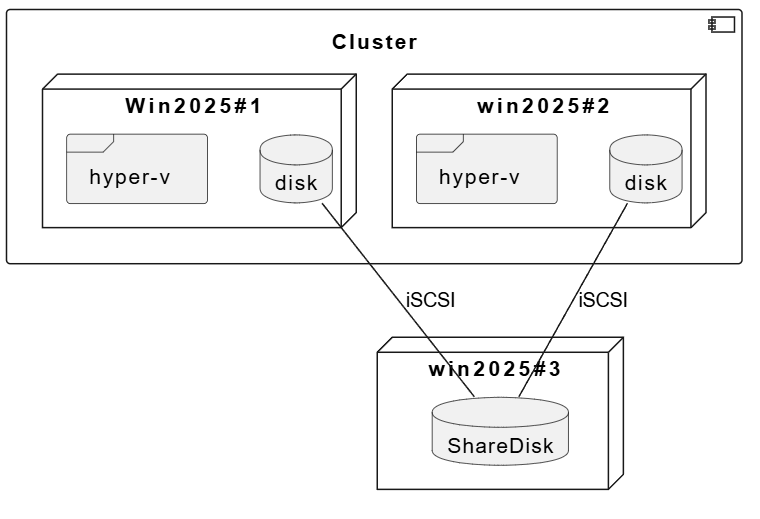
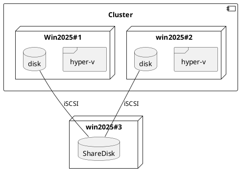

# 2026/04/06

## Todo

- [ ] POC環境の構成検討
  - [ ] hyper-vクラスタについて
    - [ ] 共有ディスク
    - [ ] quorum
    - ~~DNS(ActiveDirectory)~~

### 今日の構成(目標)





#### 1. 各ノードの基本準備

各ノードで管理者権限PowerShellを実行。

- ホスト名設定:
  - win2025#1: `Rename-Computer -NewName "Win2025-1" -Restart`
  - win2025#2: `Rename-Computer -NewName "Win2025-2" -Restart`
  - win2025#3: `Rename-Computer -NewName "Win2025-3" -Restart`
- IP設定 (固定IP、ゲートウェイ192.168.0.1、DNSなし):
  - win2025#1: `New-NetIPAddress -InterfaceAlias "イーサネット" -IPAddress 192.168.0.11 -PrefixLength 24 -DefaultGateway 192.168.0.1`
  - win2025#2: `New-NetIPAddress -InterfaceAlias "イーサネット" -IPAddress 192.168.0.12 -PrefixLength 24 -DefaultGateway 192.168.0.1`
  - win2025#3: `New-NetIPAddress -InterfaceAlias "イーサネット" -IPAddress 192.168.0.13 -PrefixLength 24 -DefaultGateway 192.168.0.1`
- 時刻同期 (NTPサーバー指定、例: time.windows.com):
  - `w32tm /config /manualpeerlist:"time.windows.com" /syncfromflags:manual /update; w32tm /resync`
- hostsファイル編集 (DNS代替、各ノードで相互名前解決):
  - `Add-Content -Path C:\Windows\System32\drivers\etc\hosts -Value "192.168.0.11 Win2025-1"`
  - `Add-Content -Path C:\Windows\System32\drivers\etc\hosts -Value "192.168.0.12 Win2025-2"`
  - `Add-Content -Path C:\Windows\System32\drivers\etc\hosts -Value "192.168.0.13 Win2025-3"`

#### 2. iSCSIターゲット設定 (win2025#3)

- Hyper-Vインストール:
  - `Install-WindowsFeature Hyper-V -IncludeManagementTools -Restart`
    - 再起動後、確認: `Get-WindowsFeature Hyper-V`
- iSCSIターゲットロールインストール:
  - `Install-WindowsFeature FS-iSCSITarget-Server -IncludeManagementTools`
- 仮想ディスク作成 (例: 60GB):
  - `New-Item -Path "D:\iSCSI" -ItemType Directory`
  - `New-VHD -Path "D:\iSCSI\ClusterDisk.vhdx" -SizeBytes 60GB -Dynamic`
- iSCSIターゲット作成:
  - `New-IscsiServerTarget -TargetName "HVClusterTarget" -InitiatorIds "IPAddress:192.168.0.11","IPAddress:192.168.0.12"`
- 仮想ディスクマッピング:
  - `Add-IscsiVirtualDiskTargetMapping -TargetName "HVClusterTarget" -Path "D:\iSCSI\ClusterDisk.vhdx"`
- ファイアウォール許可:
  - `Enable-NetFirewallRule -DisplayGroup "iSCSI サービス"`

#### 3. Hyper-Vとクラスタリングインストール (win2025#1/#2)

各ノードで実行。

- ロールインストール:
  - `Install-WindowsFeature Hyper-V, Failover-Clustering, RSAT-Clustering-PowerShell -IncludeManagementTools -Restart`
- iSCSIイニシエーター設定:
  - `Set-Service -Name MSiSCSI -StartupType Automatic; Start-Service MSiSCSI`
  - `New-IscsiTargetPortal -TargetPortalAddress 192.168.0.13`  <=== ★今日も進展なし(iscsi-targetを認識できず)
  - `Connect-IscsiTarget -NodeAddress "iqn.1991-05.com.microsoft:win2025-3-hvclustertarget-target" -IsPersistent $true`
- ディスクオンライン化とフォーマット:
  - `Get-Disk | Where-Object { $_.IsOffline -eq $true } | Set-Disk -IsOffline $false`
  - `Initialize-Disk -Number 1 -PartitionStyle GPT`
  - `New-Partition -DiskNumber 1 -UseMaximumSize -AssignDriveLetter`
  - `Format-Volume -DriveLetter D -FileSystem NTFS -NewFileSystemLabel "ClusterDisk"`

#### 4. クラスタ作成 (win2025#1で実行)

- 検証 (ワークグループモード):
  - `Test-Cluster -Node Win2025-1,Win2025-2 -IgnoreStorage`
- 作成 (ワークグループ、静的IP 192.168.0.100):
  - `New-Cluster -Name "HVCluster" -Node Win2025-1,Win2025-2 -StaticAddress 192.168.0.100 -AdministrativeAccessPoint Dns`
- 共有ディスク追加:
  - `Get-ClusterAvailableDisk | Add-ClusterDisk`
- CSV有効化:
  - `Get-ClusterSharedVolume | Add-ClusterSharedVolume`

#### 5. 権限とテスト

- クラスタアクセス (ローカル管理者):
  - `Grant-ClusterAccess -Cluster "HVCluster" -User "Win2025-1\Administrator" -AccessLevel "Full"` (Win2025-2も同様)
- Hyper-V管理者権限:
  - `net localgroup "Hyper-V Administrators" /add "Win2025-1\Administrator"` (各ノード)
- テスト:
  - VM作成: `New-VM -Name "TestVM" -MemoryStartupBytes 1GB -Path "D:\VMs"`
  - フェールオーバー: `Move-ClusterVirtualMachineRole -Name "TestVM" -Node Win2025-2`

#### 注意点

- ADなしなので、ノード間認証はNTLM。パスワード同期必須。
- クォーラム: 共有ディスク使用でNodeAndDiskMajority。
- 制限: GPOなし、Kerberosなし。運用時はAD推奨。
- エラー時は `Get-ClusterLog` でログ確認。

これでワークグループHyper-Vクラスタが作成できます。

## 課題調査ログ with AI

### `New-IscsiTargetPortal` でターゲットが認識されない原因の考えられるもの

`New-IscsiTargetPortal -TargetPortalAddress 192.168.0.13` を実行してもターゲットが認識されない場合、以下の原因が考えられます。順番に確認・対処してください。Win2025-1/2 (イニシエーター側) と Win2025-3 (ターゲット側) の両方で検証が必要です。

#### 1. **ネットワーク接続の問題**

- **確認方法**: Win2025-1/2 から Win2025-3 (192.168.0.13) へ ping が通るかテスト。

    ```powershell
    ping 192.168.0.13
    ```

  - 通らない場合: IP設定、ケーブル、ゲートウェイ、またはファイアウォールをチェック。Win2025-3 のネットワークアダプタが有効か確認 (`Get-NetAdapter`)。
  - **対処**: IPアドレスやサブネットマスクが正しいか再設定。hostsファイルが正しく編集されているか確認。

#### 2. **iSCSIターゲットサービスの状態 (Win2025-3側)**

- **確認方法**: Win2025-3 で iSCSI ターゲットサービスが起動しているか。

    ```powershell
    Get-Service -Name WinTarget  # Microsoft iSCSI Target Service
    ```

  - 停止している場合: 起動 (`Start-Service WinTarget`) し、自動起動に設定 (`Set-Service WinTarget -StartupType Automatic`)。
  - **対処**: サービスがインストールされていない場合、手順2の `Install-WindowsFeature FS-iSCSITarget-Server` を再実行。

#### 3. **ファイアウォールのブロック (Win2025-3側)**

- **確認方法**: iSCSI 関連のファイアウォールルールが有効か。

    ```powershell
    Get-NetFirewallRule -DisplayGroup "iSCSI サービス"
    ```

  - 無効の場合: 有効化 (`Enable-NetFirewallRule -DisplayGroup "iSCSI サービス"`)。
  - **対処**: 追加でポート 3260 (iSCSI) が開放されているか確認。必要に応じてカスタムルールを追加。

#### 4. **ターゲット作成の確認 (Win2025-3側)**

- **確認方法**: ターゲットが正しく作成されているか。

    ```powershell
    Get-IscsiServerTarget
    ```

  - 出力がない場合: 手順2の `New-IscsiServerTarget` を再実行。InitiatorIds が Win2025-1/2 の IP (192.168.0.11, 192.168.0.12) と一致するか確認。
  - **対処**: 仮想ディスクがマッピングされているか (`Get-IscsiVirtualDiskTargetMapping`) 確認。ディスクパスが正しいか再作成。

#### 5. **ポータル追加後のターゲット発見の問題 (Win2025-1/2側)**

- **確認方法**: ポータル追加後、ターゲットを発見できるか。

    ```powershell
    New-IscsiTargetPortal -TargetPortalAddress 192.168.0.13
    Get-IscsiTarget  # ターゲット一覧を表示
    ```

  - ターゲットが見えない場合: `Update-IscsiTargetPortal -TargetPortalAddress 192.168.0.13` でポータルを更新してから再試行。
  - **対処**: IQN (NodeAddress) が不明な場合、Win2025-3 で `Get-IscsiServerTarget | Select-Object TargetName, TargetIqn` を実行して正しい IQN を取得。ファイルの例 ("iqn.1991-05.com.microsoft:win2025-3-hvclustertarget-target") は自動生成されるので、実際の値を確認。

#### 6. **MSiSCSI サービスの状態 (Win2025-1/2側)**

- **確認方法**: イニシエーターサービスが起動しているか。

    ```powershell
    Get-Service MSiSCSI
    ```

  - 停止している場合: 起動 (`Start-Service MSiSCSI`) し、自動起動に設定 (`Set-Service MSiSCSI -StartupType Automatic`)。
  - **対処**: サービスが無効の場合、手順3の `Set-Service MSiSCSI -StartupType Automatic` を再実行。

#### 7. **その他の潜在的な問題**

- **DNS/名前解決**: hostsファイルが正しく編集されているか確認。Win2025-3 を名前で参照できるか (`ping Win2025-3`)。
- **ログ確認**: Win2025-3 でイベントログ (`Get-EventLog -LogName System -Source Microsoft-Windows-iSCSITarget`) やクラスタログ (`Get-ClusterLog`) をチェック。
- **再起動**: すべての変更後、各ノードを再起動してサービスをリフレッシュ。
- **バージョン互換**: Windows Server 2025 の iSCSI 機能が正しく動作するか確認 (KBや更新プログラム適用)。

これらの確認で解決しない場合、Win2025-3 の iSCSI ターゲット設定を最初からやり直すことを検討してください。エラーメッセージがあれば共有いただけると、より具体的なアドバイスが可能です。

### 考えられる原因と対策

確認結果から、ネットワーク、サービス起動、ファイアウォールは問題ないようです。残る主な原因はiSCSIターゲットの発見プロセスや設定の細部です。Win2025-2 (イニシエーター側) で以下の順に確認・対処してください。

#### 1. **ポータル追加後のターゲット発見の確認**

- **原因**: `New-IscsiTargetPortal` はポータルを追加するだけ。ターゲットを発見するには別途 `Get-IscsiTarget` を実行する必要があるが、タイミングやキャッシュの問題で即座に見えない場合がある。
- **確認/対策**:

    ```powershell
    # ポータル追加後、ターゲット一覧を確認
    New-IscsiTargetPortal -TargetPortalAddress 192.168.0.13
    Get-IscsiTarget  # ターゲットが見えるか確認
    ```

  - 見えない場合: `Update-IscsiTargetPortal -TargetPortalAddress 192.168.0.13` を実行してポータルを更新してから再確認。

#### 2. **ターゲットのIQN (NodeAddress) の確認**

- **原因**: `Connect-IscsiTarget` で使用するNodeAddress (IQN)が間違っている。ファイルの例 ("iqn.1991-05.com.microsoft:win2025-3-hvclustertarget-target") は自動生成されるため、実際の値と一致しない可能性。
- **確認/対策**:
  - Win2025-3 で正しいIQNを取得:

    ```powershell
    Get-IscsiServerTarget | Select-Object TargetName, TargetIqn
    ```

  - Win2025-2 で取得したIQNを使って接続を試す:

    ```powershell
    Connect-IscsiTarget -NodeAddress "<正しいIQN>" -IsPersistent $true
    ```

  - 例: `Connect-IscsiTarget -NodeAddress "iqn.1991-05.com.microsoft:win2025-3-hvclustertarget-target" -IsPersistent $true` (実際の値を置き換え)。

#### 3. **ポータルの状態確認**

- **原因**: ポータルが正しく追加されていない、または無効化されている。
- **確認/対策**:

    ```powershell
    Get-IscsiTargetPortal  # ポータル一覧を確認 (192.168.0.13 が表示されるか)
    ```

  - 表示されない場合: ポータルを再追加。必要に応じて `Remove-IscsiTargetPortal -TargetPortalAddress 192.168.0.13` で削除してから再実行。

#### 4. **Win2025-3のiSCSIターゲットサービスの再起動**

- **原因**: サービスが一時的に不安定で、ターゲットが正しく公開されていない。
- **確認/対策**:
  - Win2025-3 でサービスを再起動:

    ```powershell
    Restart-Service WinTarget
    ```

  - その後、Win2025-2 でポータル更新 (`Update-IscsiTargetPortal`) とターゲット確認を再試行。

#### 5. **イニシエーター制限の再確認**

- **原因**: Win2025-3のターゲットでInitiatorIdsがWin2025-2のIP (192.168.0.12) を許可していない (ファイルでは指定されているが、設定ミス)。
- **確認/対策**:
  - Win2025-3 でターゲットのInitiatorIdsを確認:

    ```powershell
    Get-IscsiServerTarget | Select-Object TargetName, InitiatorIds
    ```

  - IPが含まれていない場合: ターゲットを再作成 (`Remove-IscsiServerTarget -TargetName "HVClusterTarget"` してから `New-IscsiServerTarget`)。

#### 6. **ログとイベントの確認**

- **原因**: 詳細なエラーがログに記録されている。
- **確認/対策**:
  - Win2025-2 でiSCSI関連のイベントログを確認:

    ```powershell
    Get-EventLog -LogName System -Source "Microsoft-Windows-iSCSI" -Newest 10
    ```

  - Win2025-3 でターゲットログを確認:

    ```powershell
    Get-EventLog -LogName System -Source "Microsoft-Windows-iSCSITarget" -Newest 10
    ```

  - エラーメッセージがあれば、それに基づいて対処 (例: ポート3260のブロック)。

これで解決しない場合、Win2025-3のターゲット設定を削除して最初からやり直すか、Win2025-2のMSiSCSIサービスを再起動してみてください。エラーメッセージやログの詳細を共有いただけると、より精度の高いアドバイスが可能です。

## 確認すべきログ

### 1. イニシエーター側 (Win2025-2) のイベントログ

`New-IscsiTargetPortal` の失敗は、まずイニシエーター側の iSCSI イベントログを確認します。

- System ログ の iSCSI ソース
  - PowerShell:

    ```powershell
    Get-WinEvent -FilterHashtable @{
      LogName = 'System'
      ProviderName = 'Microsoft-Windows-iSCSI'
      StartTime = (Get-Date).AddMinutes(-30)
    } | Format-List TimeCreated, Id, LevelDisplayName, Message
    ```

- iSCSI Operational ログ（存在する場合）
  - PowerShell:

    ```powershell
    Get-WinEvent -LogName 'Microsoft-Windows-iSCSI/Operational' -MaxEvents 50 |
      Format-List TimeCreated, Id, LevelDisplayName, Message
    ```

- 物理ログファイル（必要なら）
  - System.evtx
  - `C:\Windows\System32\winevt\Logs\Microsoft-Windows-iSCSI%4Operational.evtx`

### 2. ターゲット側 (Win2025-3) のイベントログ

ターゲット側に問題があれば、こちらも同時に確認します。

- System ログ の iSCSI ターゲットソース
  - PowerShell:

    ```powershell
    Get-WinEvent -FilterHashtable @{
      LogName = 'System'
      ProviderName = 'Microsoft-Windows-iSCSITarget'
      StartTime = (Get-Date).AddMinutes(-30)
    } | Format-List TimeCreated, Id, LevelDisplayName, Message
    ```

- iSCSITarget Operational ログ（存在する場合）
  - PowerShell:

    ```powershell
    Get-WinEvent -LogName 'Microsoft-Windows-iSCSITarget/Operational' -MaxEvents 50 |
      Format-List TimeCreated, Id, LevelDisplayName, Message
    ```

- 物理ログファイル
  - `C:\Windows\System32\winevt\Logs\Microsoft-Windows-iSCSITarget%4Operational.evtx`

### 3. 確認の順番と見方

1. `eventvwr.msc` を起動
2. 左ペインで
   - `Windows ログ > System`
   - `アプリケーションとサービス ログ > Microsoft > Windows > iSCSI > Operational`
   - `アプリケーションとサービス ログ > Microsoft > Windows > iSCSITarget > Operational`
3. 失敗時刻に近いエラー/警告を探す
4. `Error 0xefff0003` に関連するメッセージを確認

### 4. 追加で使えるコマンド

- `wevtutil qe System /q:"*[System[Provider[@Name='Microsoft-Windows-iSCSI']]]" /c:20 /f:text`
- `wevtutil qe System /q:"*[System[Provider[@Name='Microsoft-Windows-iSCSITarget']]]" /c:20 /f:text`

---

## 期待されるログの内容

- `接続に失敗しました` の前後で
  - `Unable to connect to iSCSI target portal`
  - `Target portal not found`
  - `Network error`
  - `Authentication failed`
  - `Service unavailable`

これらを確認すると、原因が

- ポータル到達はできるがターゲット応答なし
- ターゲットサービス未起動
- ポータルの応答に失敗
- ポータルとして指定した IP がターゲットで正しく公開されていない

のどれかに絞れます。

### Win11 Hyper-V環境での考慮要素

Win11のHyper-V上でWindows Server 2025のVMをネストしてHyper-Vクラスタを作成する場合、以下の要素を考慮してください。ネストされた仮想化は可能ですが、制限があります。

#### 1. **ネストされた仮想化の有効化**

- ホスト（Win11）のVM設定で、各VMのプロセッサオプションで「仮想化をVMに公開」を有効にしないと、VM内でHyper-Vが動作しない。
- 確認: VMの設定 > プロセッサ > 「仮想化をVMに公開」チェック。

#### 2. **リソース割り当て**

- CPU: 各VMに最低2-4コア割り当て。クラスタノードは高負荷なので、ホストのCPUが十分（Intel VT-x/AMD-V対応）。
- メモリ: 各VMに4GB以上（Hyper-Vロールのため）。ホストのメモリが不足するとパフォーマンス低下。
- ストレージ: 共有ディスク用に追加のVHDXファイルを作成（動的拡張推奨）。ホストのSSD/HDD容量を確認。

#### 3. **ネットワーク設定**

- VMネットワーク: ブリッジまたは内部ネットワークを使用。NATは外部アクセスに不便。
- IP設定: VM間で固定IPを割り当て、ホストからping可能に。
- ファイアウォール: Win11ホストのファイアウォールがVM間通信をブロックしないよう確認。

#### 4. **共有ディスクの実装**

- iSCSIターゲットVMに追加のVHDXをアタッチし、共有ディスクとして使用。
- ホストのHyper-VマネージャーでVHDXを追加: VM設定 > IDEコントローラー > ハードドライブ > 新しいVHDX作成。

#### 5. **バージョン互換と制限**

- Win11 Hyper-VはWin Server 2025をサポート（Insiderビルドの場合）。安定版Win11ではWin Server 2022まで推奨。
- 制限: ネストされたVMではHyper-Vレプリカや一部の高度機能が使えない。クラスタ検証で警告が出る可能性。
- 更新: Win11とVMのOSを最新に保つ。

#### 6. **パフォーマンスと安定性**

- ホストの負荷: 複数のVM同時起動でホストが重くなる。モニタリングツール使用。
- バックアップ: VMのスナップショットを取ってテスト。
- トラブルシューティング: ホストのイベントログ（Hyper-V関連）も確認。

これらを事前に設定すれば、POC環境として動作しますが、本番運用時は物理サーバーを推奨。

### Win11ホストのファイアウォールでVM間通信を許可する手順

Win11ホストのファイアウォールがHyper-V VM間の通信（内部/プライベートネットワーク経由）をブロックしないよう、Hyper-V関連のファイアウォールルールを有効化します。ブリッジネットワークの場合は追加でiSCSIポート（3260）を許可してください。管理者権限PowerShellで実行。

#### 1. Hyper-Vファイアウォールルールの確認と有効化

```powershell
# Hyper-V関連ルールの確認
Get-NetFirewallRule -DisplayGroup "Hyper-V"

# Hyper-Vファイアウォールルールを有効化（VM管理と通信用）
Enable-NetFirewallRule -DisplayGroup "Hyper-V"
```

#### 2. iSCSI通信用ルールの確認と有効化（ブリッジネットワーク使用時）

```powershell
# iSCSI関連ルールの確認
Get-NetFirewallRule -DisplayGroup "iSCSI サービス"

# iSCSIファイアウォールルールを有効化（ポート3260許可）
Enable-NetFirewallRule -DisplayGroup "iSCSI サービス"
```

#### 3. 追加の確認とトラブルシューティング

```powershell
# ファイアウォールプロファイルの状態確認（ドメイン/プライベート/パブリック）
Get-NetFirewallProfile

# 特定のポート（例: 3260）を手動許可する場合
New-NetFirewallRule -DisplayName "Allow iSCSI" -Direction Inbound -Protocol TCP -LocalPort 3260 -Action Allow
```

これでVM間通信がブロックされにくくなります。設定後、VMを再起動してテストしてください。

### エラーコード `0xefff0003` の意味

エラーコード `0xefff0003` は **iSCSIターゲットへの接続失敗** を示しています。これは以下を意味します：

- **ネットワーク到達可能だが、iSCSIターゲットサービスが応答していない**
- **ポート3260でターゲットがリッスンしていない**
- **ターゲット側の設定または状態に問題がある**

---

### 次に確認すべき項目

前の確認結果（ping通る、MSiSCSI起動、ファイアウォール無効）から考えると、まず **Win2025-3側の詳細な状態確認** が必要です。

#### 1. **Win2025-3 でiSCSIターゲットサービスの詳細確認**

```powershell
# WinTargetサービスの状態確認
Get-Service -Name WinTarget | Select-Object Name, Status, StartType

# サービスのプロセスが実行されているか確認
Get-Process | Where-Object { $_.Name -like "*iscsi*" } | Select-Object Name, Id
```

#### 2. **ポート3260がリッスンしているか確認 (Win2025-3)**

```powershell
# TCP 3260ポートがリッスン状態か確認
netstat -ano | Where-Object { $_ -match ":3260" }

# または
Get-NetTCPConnection -LocalPort 3260 -ErrorAction SilentlyContinue
```

#### 3. **ターゲット側のネットワークバインディング確認 (Win2025-3)**

```powershell
# iSCSIターゲットのバインディング確認
Get-IscsiServerNetworkPortal
```

#### 4. **Win2025-2 からターゲットへのポート接続テスト**

```powershell
# PowerShellからポート3260への接続確認
Test-NetConnection -ComputerName 192.168.0.13 -Port 3260 -InformationLevel Detailed
```

---

### **Win11ネストHyper-V固有の可能性**

ネストされた仮想化環境では、VMのネットワークアダプタ設定が不完全だと、外部への接続が確立されません。

- VM内でネットワークアダプタが正しく認識されているか：

  ```powershell
  Get-NetAdapter
  ```

- ホスト側（Win11）のHyper-Vスイッチが正しく設定されているか確認。

**最初に確認すべき優先順：** ポート3260がリッスンしているか → ターゲットサービスが正常に動作しているか → ホストのHyper-Vスイッチ設定

### 返り値がないのは **異常です**

返り値がないということは、**iSCSI ターゲット関連のプロセスが起動していない** か、**サービスが正常に動作していない** 可能性が高いです。

WinTarget サービスが正常に起動していれば、プロセスが表示されるはずです。

---

### 次に確認すべき項目 (Win2025-3)

#### 1. **WinTarget サービスの状態確認（最優先）**

```powershell
Get-Service -Name WinTarget | Select-Object Name, Status, StartType
```

- **Status が "Running" でない場合**: サービスが停止している
- **StartType が "Automatic" でない場合**: 自動起動設定がない

#### 2. **WinTarget サービスを起動**

```powershell
Start-Service -Name WinTarget
Set-Service -Name WinTarget -StartupType Automatic
```

#### 3. **サービスの詳細エラーの確認**

```powershell
Get-Service -Name WinTarget | Get-WmiObject Win32_Service | Select-Object Name, State, ExitCode, ProcessId
```

#### 4. **イベントログで起動失敗を確認**

```powershell
Get-WinEvent -FilterHashtable @{
  LogName = 'System'
  StartTime = (Get-Date).AddHours(-1)
} | Where-Object { $_.Message -like "*WinTarget*" -or $_.Message -like "*iSCSI*" }
```

#### 5. **FS-iSCSITarget-Server ロールが正しくインストールされているか確認**

```powershell
Get-WindowsFeature FS-iSCSITarget-Server
```

---

### **最確実な確認方法: ポート 3260 のリッスン確認**

```powershell
netstat -ano | Where-Object { $_ -match ":3260" }
```

- このコマンドで結果が出れば、iSCSI ターゲットが実際にリッスンしている
- 結果がなければ、サービスが起動していないか、バインドに失敗している

**最初に `Get-Service -Name WinTarget` で状態を確認してください。**

### このエラーは **正常ではありません** - コマンド構文のエラーです

エラーメッセージから、`Get-WmiObject` がパイプ入力を受け入れないため、バインディングに失敗しています。

---

### 修正されたコマンド

以下のいずれかで WinTarget サービスの状態を確認してください。

#### **方法1: Get-Service だけで確認（簡単）**

```powershell
Get-Service -Name WinTarget
```

- Status（Running/Stopped）と StartType（Automatic/Manual など）が表示される

#### **方法2: より詳しく確認（推奨）**

```powershell
$service = Get-Service -Name WinTarget
$wmi = Get-WmiObject Win32_Service -Filter "Name='WinTarget'"
$wmi | Select-Object Name, State, ExitCode, ProcessId
```

- Name、State、ExitCode、ProcessId が表示される
- ExitCode が 0 でなければサービス起動に失敗している

#### **方法3: シンプルな別案**

```powershell
Get-Service -Name WinTarget | Select-Object Name, Status, StartType, DisplayName
```

---

### **確認ポイント**

- **Status/State が "Running" か確認**
  - 停止している場合：`Start-Service -Name WinTarget`
- **ExitCode が 0 か確認**
  - 0 以外の場合：サービス起動に失敗している可能性
- **イベントログでエラーを確認**

  ```powershell
  Get-WinEvent -FilterHashtable @{ LogName = 'System'; ProviderName = 'Service Control Manager' } | 
    Where-Object { $_.Message -like "*WinTarget*" } | Select-Object TimeCreated, Message
  ```

**最初は `Get-Service -Name WinTarget` で簡単に確認してください。**

### port 3260 がリッスンされていない原因と対処

WinTarget サービスが起動しているが port 3260 がリッスンしていないのは、**ネットワークバインディングの初期化失敗** または **iSCSI ターゲット設定の不完全** を示しています。

以下の順で確認・対処してください（Win2025-3 で実行）。

---

#### 1. **iSCSI ターゲットのネットワークポータル確認**

```powershell
Get-IscsiServerNetworkPortal
```

- **期待値**: 192.168.0.13 でリッスンしている行が表示される
- **表示されない場合**: ネットワークポータルが作成されていない

#### 2. **ネットワークポータルの手動作成**

ポータルが存在しない場合、以下で作成：

```powershell
New-IscsiServerNetworkPortal -IPAddress 192.168.0.13 -port 3260
```

#### 3. **iSCSI ターゲットサービスの再起動**

```powershell
Restart-Service -Name WinTarget -Force
Start-Sleep -Seconds 3
```

#### 4. **再度 port 3260 のリッスン確認**

```powershell
netstat -ano | Where-Object { $_ -match ":3260" }
```

---

#### 5. **ターゲット設定の確認**

リッスンしない場合、ターゲット設定を詳細確認：

```powershell
Get-IscsiServerTarget | Select-Object TargetName, Enabled
Get-IscsiVirtualDiskTargetMapping | Format-Table TargetName, Path
```

---

#### 6. **Hyper-V ネスト環境固有の問題確認**

Win11 Hyper-V 内の VM なので、**仮想ネットワークアダプター** が正しく動作しているか確認：

```powershell
Get-NetAdapter
ipconfig /all
```

- ネットワークアダプタが正しく認識されているか
- IP 192.168.0.13 が割り当たっているか

---

#### 7. **WinTarget サービスの詳細ログ確認**

```powershell
Get-WinEvent -FilterHashtable @{
  LogName = 'System'
  ProviderName = 'Service Control Manager'
  StartTime = (Get-Date).AddHours(-2)
} | Where-Object { $_.Message -like "*WinTarget*" } | Format-List TimeCreated, Message
```

---

### **最も疑わしい原因: Win11 Hyper-V ネスト環境での VM ネットワーク設定**

Win11 ホストの Hyper-V で VM 作成時、ネットワークスイッチの設定が不完全だと、VM 内から外部への通信ができないことがあります。

**確認項目:**

- VM のネットワークアダプタが **ブリッジ** または **内部ネットワーク** に接続しているか
- ホスト側（Win11）の Hyper-V スイッチ設定で、VNet 間の通信が許可されているか

順に実行して結果を教えてください。**最初に `Get-IscsiServerNetworkPortal` の結果** を確認するのが有効です。
