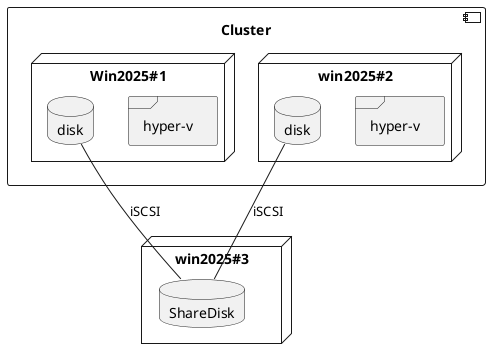

# 2026/04/07

## Todo

- [ ] POC環境の構成検討
  - [ ] hyper-vクラスタが作れない件
    - [ ] 検証環境による影響を確認

### 今日の構成(目標)

### memo

#### 検証環境による影響を確認

- iSCSIイニシエーター設定が失敗する件
  - 接続NWをprivateからinternalに変更することで解決
    - `Set-Service -Name MSiSCSI -StartupType Automatic; Start-Service MSiSCSI`
    - `New-IscsiTargetPortal -TargetPortalAddress 192.168.0.13`

- iSCSIターゲットの作成に失敗する件
  - コマンドの場合
    - 仮想ディスク作成 (例: 60GB):
      - `New-Item -Path "D:\iSCSI" -ItemType Directory`
      - `New-VHD -Path "D:\iSCSI\ClusterDisk.vhdx" -SizeBytes 60GB -Dynamic`
    - iSCSIターゲット作成:
      - `New-IscsiServerTarget -TargetName "HVClusterTarget" -InitiatorIds "IPAddress:192.168.0.11","IPAddress:192.168.0.12"` <== ここで失敗する
  - サーバマネジメントUI経由だと作成できた
    - AI: Win11 Hyper-V 内の VM では、一部の高度な Hyper-V 操作が制限される場合があります。UI では内部的に該当制限を回避しているが、PowerShell では回避されない可能性。

- オンライン化したディスクをフォーマットできない件
  - サーバマネージャのUIではディスクを認識しておりオンライン化できている
    - 読み取り専用属性がtrueとなっている
      - target側でもいまいちうまく制御できていないことを踏まえて検証環境由来の理由と推測。 <== 今日はここまで