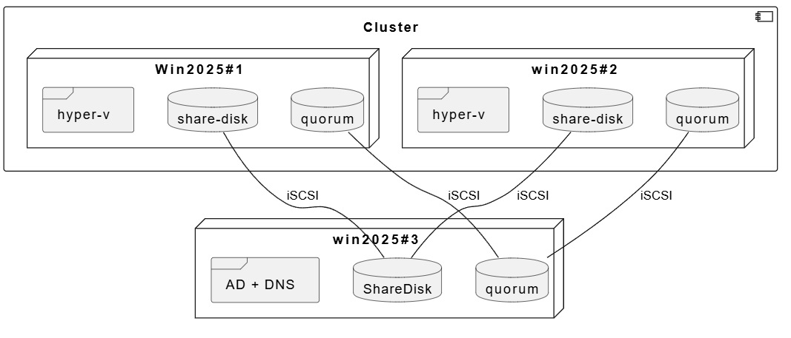
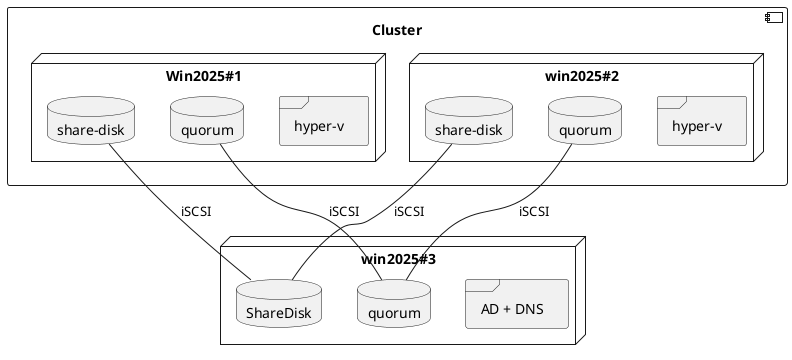

# 2026/04/08

## Todo

- [x] ADなしのhyper-vクラスタを作る(3度目の正直)
  - 問題点は徹底的にAIに解決を求める
- [x] live-migration可能かどうか確認する
  - 結論: ADなしではhyper-v failover clusterの要件を満たせない
- [x] ADアリのhyper-vクラスタを作る
- [ ] live-migrationを試す
  - live-migrationの設定でstack.....

### memo

#### 今日の構成






#### プロンプトを考えてみる

```code
win11のhyper-v環境下に以下のwin2025のhypser-vクラスタを作成しようとしています

- win2025#1:
  - lang: 日本語
  - ip: 192.168.0.11
  - hyper-v node1
  - disks:
    - C: system
    - D: DVD
- win2025#2:
  - lang: 日本語
  - ip: 192.168.0.12
  - hyper-v node2
  - disks:
    - C: system
    - D: DVD
- win2025#3:
  - lang: 日本語
  - ip: 192.168.0.13
  - AD + DNS
  - iSCSI-target,クラスタ用shareディスク
  - disks:
    - C: system
    - D: for share disk
    - E: DVD

構築の具体的手順をコマンドベースで提示してください
設定コマンドの後に確認用のコマンドを提示してください
```

### AI提示の構築手順(添削結果)

## 1. 前提準備

- Windows 11 ホストに Hyper-V が有効化されていること
- 管理者権限の PowerShell で実行すること
- Windows Server 2025 日本語版の ISO が用意できていること
- ホストの実ネットワークに接続できる仮想スイッチを作成すること

---

## 2. Hyper-V 上の仮想スイッチ作成

```powershell
New-VMSwitch -Name "vSwitch-Cluster" -NetAdapterName "Ethernet" -AllowManagementOS $true
```

> `NetAdapterName` は実環境の物理 NIC 名に置き換えてください。

- ここは作成済みのInternal-NWを使う

---

## 3. VM の作成

### win2025-1 / win2025-2

```powershell
$base = "C:\ProgramData\Microsoft\Windows\Virtual Hard Disks"
New-Item -ItemType Directory -Path $base -Force

New-VM -Name win2025-1 -MemoryStartupBytes 4GB -Generation 2 -Path $base -NewVHDPath "$base\win2025-1\win2025-1-system.vhdx" -NewVHDSizeBytes 64GB -SwitchName "InternalNAT"
Set-VM -Name win2025-1 -ProcessorCount 4
Add-VMDvdDrive -VMName win2025-1 -Path "C:\Users\nante\Downloads\26100.32230.260111-0550.lt_release_svc_refresh_SERVER_EVAL_x64FRE_ja-jp.iso"
Set-VMFirmware -VMName win2025-1 -FirstBootDevice (Get-VMDvdDrive -VMName win2025-1)
Set-VMProcessor -VMName "win2025-1" -ExposeVirtualizationExtensions $true
Set-VMNetworkAdapter -VMName "win2025-1" -MacAddressSpoofing On
```

```powershell
$base = "C:\ProgramData\Microsoft\Windows\Virtual Hard Disks"
New-Item -ItemType Directory -Path $base -Force

New-VM -Name win2025-2 -MemoryStartupBytes 4GB -Generation 2 -Path $base -NewVHDPath "$base\win2025-2\win2025-2-system.vhdx" -NewVHDSizeBytes 64GB -SwitchName "InternalNAT"
Set-VM -Name win2025-2 -ProcessorCount 4
Add-VMDvdDrive -VMName win2025-2 -Path "C:\Users\nante\Downloads\26100.32230.260111-0550.lt_release_svc_refresh_SERVER_EVAL_x64FRE_ja-jp.iso"
Set-VMFirmware -VMName win2025-2 -FirstBootDevice (Get-VMDvdDrive -VMName win2025-2)
Set-VMProcessor -VMName "win2025-2" -ExposeVirtualizationExtensions $true
Set-VMNetworkAdapter -VMName "win2025-2" -MacAddressSpoofing On
```

### win2025-3 (iSCSI ターゲット)

```powershell
$base = "C:\ProgramData\Microsoft\Windows\Virtual Hard Disks"
New-Item -ItemType Directory -Path $base -Force

New-VM -Name win2025-3 -MemoryStartupBytes 4GB -Generation 2 -Path $base -NewVHDPath "$base\win2025-3\win2025-3-system.vhdx" -NewVHDSizeBytes 64GB -SwitchName "InternalNAT"
Set-VM -Name win2025-3 -ProcessorCount 4
New-VHD -Path "$base\win2025-3\win2025-3-share.vhdx" -SizeBytes 100GB -Dynamic
Add-VMHardDiskDrive -VMName win2025-3 -Path "$base\win2025-3\win2025-3-share.vhdx"
Add-VMDvdDrive -VMName win2025-3 -Path "C:\Users\nante\Downloads\26100.32230.260111-0550.lt_release_svc_refresh_SERVER_EVAL_x64FRE_ja-jp.iso"
Set-VMFirmware -VMName win2025-3 -FirstBootDevice (Get-VMDvdDrive -VMName win2025-3)
Set-VMProcessor -VMName "win2025-3" -ExposeVirtualizationExtensions $true
Set-VMNetworkAdapter -VMName "win2025-3" -MacAddressSpoofing On
```

---

## 4. VM を起動し OS をインストール

### win2025-1

```powershell
Start-VM win2025-1
```

### win2025-2

```powershell
Start-VM win2025-2
```

### win2025-3

```powershell
Start-VM win2025-3
```

- 各 VM に Windows Server 2025 をインストール
- 言語は日本語
- `Administrator` のパスワードは 3 台とも同じにする

---

## 5. ゲスト OS 側での初期設定

### コンピューター名変更

各 VM の PowerShell で実行：

- win2025-1

```powershell
Rename-Computer -NewName win2025-1 -Restart
```

- win2025-2

```powershell
Rename-Computer -NewName win2025-2 -Restart
```

### ネットワーク固定 IP 設定

各 VM で以下を実行し、IP を設定します。

- win2025-1

```powershell
New-NetIPAddress -InterfaceAlias "イーサネット" -IPAddress 192.168.0.11 -PrefixLength 24 -DefaultGateway 192.168.0.1
Set-DnsClientServerAddress -InterfaceAlias "イーサネット" -ServerAddresses 192.168.0.1
```

- win2025-2

```powershell
New-NetIPAddress -InterfaceAlias "イーサネット" -IPAddress 192.168.0.12 -PrefixLength 24 -DefaultGateway 192.168.0.1
Set-DnsClientServerAddress -InterfaceAlias "イーサネット" -ServerAddresses 192.168.0.1
```

> `InterfaceAlias` は `Get-NetAdapter` で確認し、実際の NIC 名に置き換えてください。

---

### 5.5 AD構築

以下は、win2025-3 を AD DS + DNS サーバー（新規フォレストの最初のDC）として構築する、コマンドベースの最短手順です。  
前提は「管理者権限の PowerShell」で実行します。

前提値（必要なら置き換え）

- サーバー名: WIN2025-3
- IP: 192.168.0.13/24
- GW: 192.168.0.1
- ドメイン名: lab.local
- NetBIOS名: LAB
- NIC名: Ethernet（環境に合わせて変更）

### 1. ホスト名とIPを固定化

設定コマンド

```powershell
Rename-Computer -NewName "WIN2025-3" -Force

$if = "イーサネット"
New-NetIPAddress -InterfaceAlias $if -IPAddress "192.168.0.13" -PrefixLength 24 -DefaultGateway "192.168.0.1"
Set-DnsClientServerAddress -InterfaceAlias $if -ServerAddresses "192.168.0.13"

Restart-Computer
```

確認コマンド

```powershell
hostname
Get-NetIPAddress -InterfaceAlias "イーサネット" -AddressFamily IPv4
Get-DnsClientServerAddress -InterfaceAlias "イーサネット" -AddressFamily IPv4
```

### 1.5 時刻同期設定

- インターネットに出ない閉域ラボの場合:

```powershell
w32tm /config /syncfromflags:domhier /reliable:yes /update
Restart-Service w32time
w32tm /resync
```

- 確認:

```powershell
w32tm /query /configuration
w32tm /query /status
w32tm /query /source
nltest /dsgetdc:lab.local /timeserv
```

- 期待:
  - reliable が有効
  - nltest でタイムサーバーとして引ける
  - SYSVOL と NETLOGON 共有を確認（DFSR警告対処）

### 2. AD DS / DNS 役割をインストール

設定コマンド

```powershell
Install-WindowsFeature AD-Domain-Services,DNS -IncludeManagementTools
```

確認コマンド

```powershell
Get-WindowsFeature AD-Domain-Services,DNS | Select-Object DisplayName, InstallState
```

### 3. 新規フォレストを作成してDC昇格

設定コマンド

```powershell
$dsrm = Read-Host "DSRMパスワードを入力" -AsSecureString

Install-ADDSForest `
  -DomainName "lab.local" `
  -DomainNetbiosName "LAB" `
  -InstallDNS `
  -SafeModeAdministratorPassword $dsrm `
  -Force
```

- 警告が出るけど、新規ラボ構成ではほぼ想定どおりでここでは問題なし
- 実行後、自動再起動します。

確認コマンド（再起動後）

```powershell
$env:USERDNSDOMAIN
(Get-ComputerInfo).CsDomain
```

### 4. AD DS / DNS の稼働確認

確認コマンド

```powershell
Get-Service NTDS,DNS,Netlogon | Select-Object Name, Status, StartType

Get-ADDomain
Get-ADForest

Get-DnsServerZone | Select-Object ZoneName, ZoneType, IsDsIntegrated

Resolve-DnsName "win2025-3.lab.local"
Resolve-DnsName -Type SRV "_ldap._tcp.dc._msdcs.lab.local"

nltest /dsgetdc:lab.local
dcdiag /q
```

確認の見方

- Get-Service: NTDS/DNS/Netlogon が Running
- Get-ADDomain / Get-ADForest: 情報が正常に返る
- Resolve-DnsName SRV: _ldap._tcp.dc._msdcs.lab.local が引ける
- nltest: DC情報が返る
- dcdiag /q: 何も出なければ概ね正常

### 5.（次工程向け）ノード参加前に使うDNS確認

win2025-1 / win2025-2 側で、DNSを win2025-3 に向ける前提です。  
参加前の疎通確認コマンド例（各ノードで実行）:

```powershell
Test-NetConnection 192.168.0.13 -Port 53
nslookup lab.local 192.168.0.13
```

## 6. クラスター用機能のインストール

- win2025-1 / win2025-2

```powershell
Install-WindowsFeature -Name Failover-Clustering -IncludeManagementTools
```

- win2025-3

```powershell
Install-WindowsFeature -Name FS-iSCSITarget-Server -IncludeManagementTools
```

---

## 7. win2025-3 で iSCSI ターゲット構成

### iSCSI 仮想ディスク作成

```powershell
New-IscsiVirtualDisk -Path "D:\ClusterShare.vhdx" -Size 60GB
```

#### iSCSI ターゲット作成

```powershell
New-IscsiServerTarget -TargetName "ClusterShare" -InitiatorIds "IQN:*"
Add-IscsiVirtualDiskTargetMapping -TargetName "ClusterShare" -Path "D:\ClusterShare.vhdx"
```

#### ファイアウォール許可（必要なら）

```powershell
Enable-NetFirewallRule -Name "MSIscsi-In-TCP"
```

---

## 8. win2025-1 / win2025-2 で iSCSI クライアント接続

各ノードで以下を実行：

```powershell
Set-Service -Name MSiSCSI -StartupType Automatic
Start-Service -Name MSiSCSI

New-IscsiTargetPortal -TargetPortalAddress 192.168.0.13
Get-IscsiTarget | Connect-IscsiTarget -IsPersistent $true
```

### 共有ディスクの確認

```powershell
Get-Disk | Where-Object PartitionStyle -Eq 'RAW'
```

> 共有ディスクは両ノードで同じディスク番号を持つ場合がありますが、クラスターとしてのみ利用します。

---

## 8.5 共有ディスクを

### 1. win2025-1のノードだけでディスクを初期化する

```powershell
Initialize-Disk -Number 1 -PartitionStyle GPT
New-Partition -DiskNumber 1 -UseMaximumSize -AssignDriveLetter | Format-Volume -FileSystem NTFS -NewFileSystemLabel "ClusterDisk1" -Confirm:$false
```

### 2. win2025-2のノードではオフラインにする

```powershell
Set-Disk -Number 1 -IsOffline $true
```

---

## 9. クラスター作成

### node1 もしくは node2 で実行

```powershell
Import-Module FailoverClusters

New-Cluster -Name "CLUSTER1" -Node win2025-1,win2025-2 -StaticAddress 192.168.0.20 -NoStorage -Force
```

- `-NoStorage` は共有ストレージを後から追加するため
- AD が無くてもローカルワークグループクラスタとして構築

---

## 10. 共有ディスクをクラスターに追加

```powershell
Get-ClusterAvailableDisk | Add-ClusterDisk
```

### CSV にする場合

```powershell
Get-ClusterResource "クラスター ディスク 1" | Add-ClusterSharedVolume
```

---

## 11. 動作確認

```powershell
Get-Cluster
Get-ClusterNode
Get-ClusterResource
Get-ClusterSharedVolume
```

---

## 補足

- `win2025-3` は iSCSI ターゲットのみを提供する役割
- `win2025-1` / `win2025-2` がクラスターノード
- AD なしの構成では、各ノードのローカル管理者パスワードを統一すること
- `Test-Cluster` は AD なし環境では一部チェックが通りにくいため、クラスタ作成を優先してください

これで、Hyper-V 上の `win2025-1` / `win2025-2` に、`win2025-3` から提供される iSCSI 共有ディスクを使ったワークグループクラスタを構築できます。

---

## AD構成での続き手順

> win2025-3 に AD DS + DNS を構築済みであることが前提。  
> 以下を順に実行して、フェールオーバークラスタ + Live Migration を完成させる。

前提値
- ドメイン: lab.local
- DC / DNS: 192.168.0.13 (win2025-3)
- ノード1: win2025-1 (192.168.0.11)
- ノード2: win2025-2 (192.168.0.12)
- クラスタ仮想IP: 192.168.0.100

---

## 12. win2025-1 / win2025-2 の DNS を win2025-3 に向ける

> 各ノードの PowerShell で実行する。

win2025-1:

```powershell
Set-DnsClientServerAddress -InterfaceAlias "イーサネット" -ServerAddresses "192.168.0.13"
```

win2025-2:

```powershell
Set-DnsClientServerAddress -InterfaceAlias "イーサネット" -ServerAddresses "192.168.0.13"
```

確認（各ノード）:

```powershell
Get-DnsClientServerAddress -InterfaceAlias "イーサネット" -AddressFamily IPv4
Resolve-DnsName win2025-3.lab.local
```

---

## 13. win2025-1 / win2025-2 をドメイン参加させる

> 各ノードの PowerShell で実行する。

```powershell
Add-Computer -DomainName "lab.local" -Credential (Get-Credential "LAB\Administrator") -Restart
```

- プロンプトが出たら lab\Administrator のパスワードを入力する
- 再起動後、ドメイン参加が完了する

確認（再起動後）:

```powershell
(Get-ComputerInfo).CsDomain
whoami
```

期待値:
- `lab.local`
- `lab\administrator`

---

## 14. Hyper-V とフェールオーバークラスタ機能のインストール

> win2025-1 / win2025-2 それぞれの PowerShell で実行する。

```powershell
Install-WindowsFeature Hyper-V, Failover-Clustering, RSAT-Clustering-PowerShell -IncludeManagementTools -Restart
```

確認（再起動後）:

```powershell
Get-WindowsFeature Hyper-V, Failover-Clustering | Select-Object DisplayName, InstallState
```

---

## 15. win2025-3 で iSCSI ターゲットを構成する

> win2025-3 の PowerShell で実行する。

### 15.1 iSCSI ターゲットサーバー役割インストール

```powershell
Install-WindowsFeature FS-iSCSITarget-Server -IncludeManagementTools
```

確認:

```powershell
Get-WindowsFeature FS-iSCSITarget-Server | Select-Object DisplayName, InstallState
Get-Service WinTarget | Select-Object Name, Status, StartType
```

### 15.2 共有ディスク用フォルダ作成と仮想ディスク作成

```powershell
New-Item -Path "D:\iSCSI" -ItemType Directory -Force
New-IscsiVirtualDisk -Path "D:\iSCSI\ClusterDisk.vhdx" -Size 60GB
New-IscsiVirtualDisk -Path "D:\iSCSI\Quorum1GB.vhdx" -Size 1GB
```

### 15.3 iSCSI ターゲット作成と仮想ディスクのマッピング

```powershell
New-IscsiServerTarget -TargetName "HVClusterTarget" `
  -InitiatorIds "IPAddress:192.168.0.11","IPAddress:192.168.0.12"

Add-IscsiVirtualDiskTargetMapping `
  -TargetName "HVClusterTarget" `
  -Path "D:\iSCSI\ClusterDisk.vhdx"
Add-IscsiVirtualDiskTargetMapping `
  -TargetName "HVClusterTarget" `
  -Path "D:\iSCSI\Quorum1GB.vhdx"
```

### 15.4 ファイアウォール許可

```powershell
Enable-NetFirewallRule -DisplayGroup "iSCSI サービス"
```

確認:

```powershell
Get-IscsiServerTarget | Select-Object TargetName, TargetIqn, IsChapEnabled
Get-IscsiServerTarget | ForEach-Object {
    $t = $_
    $_.LunMappings | Select-Object `
        @{Name='TargetName';Expression={$t.TargetName}},
        @{Name='Lun';Expression={$_.Lun}},
        @{Name='Path';Expression={$_.Path}}
}
netstat -ano | Select-String ":3260"
```

---

## 16. win2025-1 / win2025-2 で iSCSI イニシエーターを設定する

> 各ノードの PowerShell で実行する。

### 16.1 MSiSCSI サービスを有効化

```powershell
Set-Service -Name MSiSCSI -StartupType Automatic
Start-Service -Name MSiSCSI
```

### 16.2 ターゲットポータルを追加してターゲットに接続

```powershell
New-IscsiTargetPortal -TargetPortalAddress 192.168.0.13
```

確認（IQN を取得）:

```powershell
Get-IscsiTarget
```

接続（取得した IQN を指定）:

```powershell
Connect-IscsiTarget `
  -NodeAddress "iqn.1991-05.com.microsoft:win2025-3-hvclustertarget-target" `
  -IsPersistent $true
```

確認:

```powershell
Get-IscsiSession | Select-Object SessionIdentifier, InitiatorNodeAddress, TargetNodeAddress, IsConnected
Get-Disk | Where-Object BusType -eq "iSCSI" | Select-Object Number, FriendlyName, Size, OperationalStatus
```

---

## 17. 共有ディスクを初期化する（win2025-1 だけで実行）

> **win2025-1 だけ** で実行する。win2025-2 では実行しない。

```powershell
$disk = Get-Disk | Where-Object { $_.BusType -eq "iSCSI" -and $_.PartitionStyle -eq "RAW" }
Initialize-Disk -Number $disk.Number -PartitionStyle GPT
New-Partition -DiskNumber $disk.Number -UseMaximumSize -AssignDriveLetter |
  Format-Volume -FileSystem NTFS -NewFileSystemLabel "ClusterDisk" -Confirm:$false
```

> win2025-2 では iSCSI 接続後にディスクがオフラインのまま放置する。クラスタが管理する。

確認（win2025-1）:

```powershell
Get-Disk | Where-Object BusType -eq "iSCSI" | Select-Object Number, PartitionStyle, OperationalStatus
Get-Volume | Where-Object FileSystemLabel -eq "ClusterDisk"
```

---

## 18. クラスタ検証とクラスタ作成（win2025-1 で実行）

### 18.1 クラスタ検証

```powershell
Test-Cluster -Node win2025-1,win2025-2
```

> 警告が出ても、エラーがなければ続行可能。HTMLレポートが生成される。

### 18.2 フェールオーバークラスタ作成

```powershell
New-Cluster -Name "HVCluster" `
  -Node win2025-1,win2025-2 `
  -StaticAddress 192.168.0.100
```

確認:

```powershell
Get-Cluster | Select-Object Name, SharedVolumesRoot
Get-ClusterNode | Select-Object Name, State, NodeWeight
```

---

## 19. 共有ディスクをクラスタに追加して CSV 化（win2025-1 で実行）

### 19.1 クラスタ利用可能ディスクに追加

```powershell
Get-ClusterAvailableDisk | Add-ClusterDisk
```

### 19.2 クラスタ共有ボリューム（CSV）に昇格

```powershell
Get-ClusterResource | Where-Object ResourceType -eq "Physical Disk" | Add-ClusterSharedVolume
```

確認:

```powershell
Get-ClusterSharedVolume | Select-Object Name, State, SharedVolumeInfo
```

期待値: State が `Online`

---

## 20. Live Migration の設定（win2025-1 で実行）

### 20.1 Live Migration を有効化

```powershell
Enable-VMMigration -ComputerName win2025-1
Enable-VMMigration -ComputerName win2025-2
```

### 20.2 認証方式を Kerberos に設定（AD 環境では推奨） <=== ★今日はここまで

```powershell
Set-VMHost -ComputerName win2025-1 -VirtualMachineMigrationAuthenticationType Kerberos
Set-VMHost -ComputerName win2025-2 -VirtualMachineMigrationAuthenticationType Kerberos
```

### 20.3 移行に使うネットワークを設定

```powershell
Add-VMMigrationNetwork -ComputerName win2025-1 -Subnet "192.168.0.0/24" -Priority 1
Add-VMMigrationNetwork -ComputerName win2025-2 -Subnet "192.168.0.0/24" -Priority 1
```

確認:

```powershell
Get-VMHost -ComputerName win2025-1 | Select-Object VirtualMachineMigrationEnabled, VirtualMachineMigrationAuthenticationType
Get-VMMigrationNetwork -ComputerName win2025-1
```

---

## 21. テスト VM を作成してクラスタロール化（win2025-1 で実行）

### 21.1 CSV 上に VM を作成

```powershell
$csvPath = "C:\ClusterStorage\Volume1"
New-VM -Name "TestVM" `
  -MemoryStartupBytes 1GB `
  -Path $csvPath `
  -NewVHDPath "$csvPath\TestVM\TestVM.vhdx" `
  -NewVHDSizeBytes 20GB `
  -Generation 2 `
  -ComputerName win2025-1
```

### 21.2 VM をクラスタロールとして登録

```powershell
Add-ClusterVirtualMachineRole -VirtualMachine "TestVM" -Cluster "HVCluster"
```

確認:

```powershell
Get-ClusterGroup | Select-Object Name, State, OwnerNode
```

---

## 22. Live Migration テスト（win2025-1 で実行）

### 22.1 VM の現在オーナーを確認

```powershell
Get-ClusterGroup -Name "TestVM" | Select-Object Name, OwnerNode
```

### 22.2 Live Migration を実行

```powershell
Move-ClusterVirtualMachineRole -Name "TestVM" -Node win2025-2 -MigrationType Live
```

### 22.3 移行後の確認

```powershell
Get-ClusterGroup -Name "TestVM" | Select-Object Name, State, OwnerNode
Get-VM -ComputerName win2025-2 -Name "TestVM" | Select-Object Name, State, CPUUsage
```

期待値:
- `OwnerNode` が `win2025-2` に変わっている
- `State` が `Running` のまま

### 22.4 折り返し確認（win2025-1 に戻す）

```powershell
Move-ClusterVirtualMachineRole -Name "TestVM" -Node win2025-1 -MigrationType Live
Get-ClusterGroup -Name "TestVM" | Select-Object Name, State, OwnerNode
```

---

## 23. クラスタ全体の最終確認

```powershell
Get-Cluster
Get-ClusterNode | Select-Object Name, State, NodeWeight
Get-ClusterResource | Select-Object Name, State, ResourceType, OwnerNode, OwnerGroup
Get-ClusterSharedVolume | Select-Object Name, State
Get-ClusterGroup | Select-Object Name, State, OwnerNode
```

問題があれば以下でログを確認:

```powershell
Get-ClusterLog -Destination "C:\Temp" -TimeSpan 60
```

